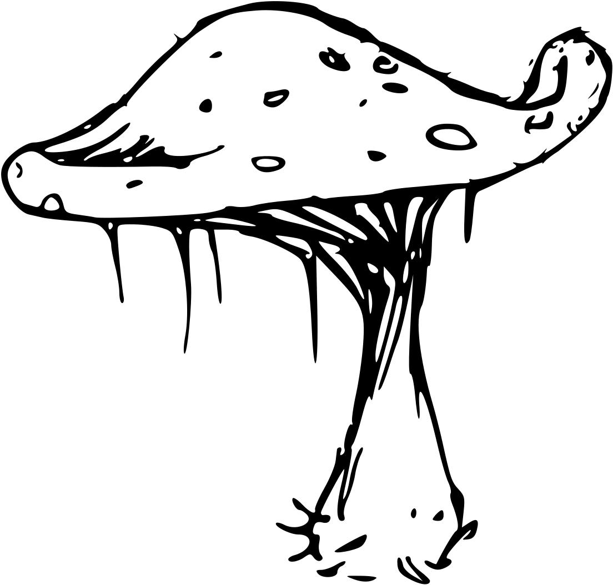
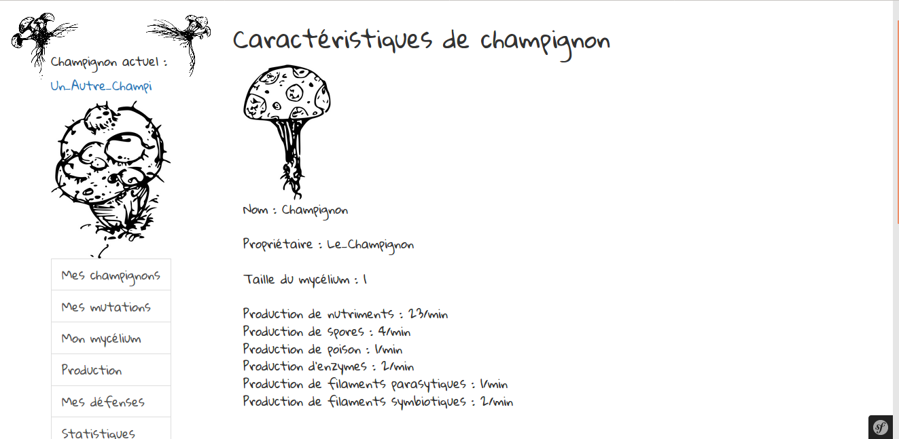

# 2017-Mycelium

Projet réalisé par : Timon De Morel et Guillaume Lictevout.

Dans le cadre du cours de programmation web de notre 3ème année de licence informatique à Paris 7 Diderot.

## Instructions

* Assurez-vous d'avoir MySQL installé

* Lancez les commandes suivantes depuis le répertoire projet_web

    * bin/console doctrine:database:create
    * bin/console doctrine:schema:update --force

* Lancez la commande suivante depuis le répertoire projet web : bin/console server:start

* Allez sur l'url : localhost:8000/mycelium

### Cheats

Si vous voulez des stocks de nutriments ou de spores en plus pour pouvoir tester, lancez depuis MySQL les commandes :

* use symfony

* UPDATE champignon SET stock_nutriments = <valeur> WHERE id = <id de votre champignon>;

* UPDATE champignon SET stock_spores = <valeur> WHERE id = <id de votre champignon>;

## Implémentations obligatoires

* Authentification : Lorsqu'on n'est pas connecté, possibilité de s'inscrire ou de se connecter dans la barre de navigation en haut à droite

* Personnages :
    * Lorsqu'on se connecte, on propose directement au joueur de créer son premier champignon

    * Le joueur pourra ensuite changer de champignon depuis la rubrique "Mes Champignons" lorsqu'il en aura créé d'autres

    * La création d'un personnage supplémentaire demande des ressources (donnez-vous des ressources pour tester avec les commandes dans la catégorie Cheats ci-dessus)

    * Chaque personnage a ses propres ressources : nutriments, sporces, poison, etc.

    * Chaque personnage a ses prendre actions : étendre son mycélium

    * L'utilisateur peut changer de personnage à tout instant

* Ressources pertinentes :

    * Persistent entre les connexions successives de l'utilisateur

    * Quantité limitée (par le temps, pas de maximum cependant)

    * Actions qui influent sur ces ressources : créer un nouveau champignon, étendre son mycélium

    * Les ressources sont affichées en bas à gauche dans le menu sur chaque page du site

* Points d'action :

    * Toutes les ressources d'un personnage augmentent avec le temps : nutriments, spores, etc.

* Avatars :

    * On peut uploader une photo depuis la page "Mon Compte", disponible en cliquant sur son pseudo dans la barre de navigation en haut à gauche.

## Implémentations supplémentaires

* Affichage des personnages :

    * Les personnages sont affichés lorsqu'on clique dans la barre de navigation en haut à droite sur "Trouver un champignon", on peut depuis cette page rechercher un champignon avec son nom. On affiche quelques informations sur les champignons, avec deux boutons permettant de voir les caractéristiques de ce champignon, et un permettant d'envoyer un message à son propriétaire.

    * De même, une page existe pour une liste des joueurs, avec recherches, affichage de la photo de profil, possibilité d'envoyer un message grâce à un bouton. Les joueurs sont affichés par ordre du plus récent qui s'est connecté.

* Statistiques :

    * Sur toutes les pages du site, dans le footer, s'affiche le nombre de joueurs inscrits et le nombre de joueurs connectés (un joueur est considéré connecté si il a chargé une page du site il y a moins de 5 minutes)

    * On a dans le menu à gauche une rubrique "Statistiques" affichant quelques statistiques concernant le joueur et le champignon (personnage) courant, ainsi que des statistiques sur le site.

* Messages privés :

    * On a la possibilité d'envoyer des message depuis la page /mycelium/ecrire-message, ou en cliquant sur le bouton permettant d'écrire un message depuis la page "Mes Messages", accessible depuis la barre de navigation en haut à gauche. Sur cette dernière page, on trouvera la liste des messages envoyés et reçus, avec un bouton permettant de les lire.

    * Sur la page de lecture d'un message, on pourra renvoyer un message au destinataire ou répondre selon le cas.

    * Il existe plusieurs pages sur le site où on a accès à la page d'écriture de message directement avec le nom du destinataire pré-rempli.

## Quelques mots en plus sur le site

* Vous pouvez trouver les idées générales du jeu dans le fichier Idée.txt

* Auto-complétion : Nous avons une auto-complétion disponible pour le recherche de joueur et de champignon, ainsi que lorsqu'on rentre un destinataire lorsqu'on écrit un message.

* Images : Les images du site ont été dessinées par Timon De Morel

* Les mutations et les défenses : Idées pour le site que nous n'avons pas eu le temps d'implémenter.

    * Les mutations devaient permettre, selon le type de cases où est le mycélium, de permettre de produire plus de ressources, et de profiter d'un bonus de production pendant un certain temps.

    * Les défenses auraient pu servir pour le multijoueur et pour des événements en général.

    * Vous pouvez trouver la liste des mutations que nous voulions faire dans le fichier archive_idees/Mutation.ods

## Idées pour l'implémentation du jeu

* Les cases :

    * De base, une case possède les stats suivantes :

        * Prod. nutriments : + [1 à 3]

        * Prod. spores :	+ [1 à 2]

        * Prod. poison : + [1 à 2] (Si la mutation "Poison" est achetée)

        * Prod. enzymes :	+ [1 à 2] (Si la mutation "Digestion" est achetée)

        * Prod. filaments para. : + [1 à 2] (Si la mutation "Parasitisme" est achetée)

        * Prod. filaments sym. : + [1 à 2] (Si la mutation "Symbiose" est achetée)

    * La production de base est déterminée aléatoirement, dans le domaine des valeurs ci-dessus.

    * La case peut également se voir doter d'une caractéristique secondaire parmi les suivantes :

        1. Grand organisme (possibilité de parasitisme ou symbiose)

        2. Petit organisme (possibilité de digestion par enzyme)

        3. Terrain fertile (+1 pour la production de ressources)

        4. Maladie (nécessite la mutation "Système immunitaire", la production de ressources de la case est bloquée sinon)

        5. Terrain désert (-1 pour la production de ressources, à moins d'avoir la mutation "Champicactus")

        6. Champignonnière abandonnée (double la production de spores sur la case)

    * Une chance sur 20 pour être case d'être d'un certain type, 6 chances sur 20 donc pour être une case spéciale.

    * Note : Les cases implémentent les caractéristiques secondaires, cependant, comme nous n'avons pas les mutations, nous n'avons pas implémenté les différentes conditions nécessaires pour telle ou telle chose. Les ressources sont donc toutes produites sans tenir compte de l'idée de base pour les mutations et sans blocage (les filaments parasitiques sont produits malgré l'absence de mutation, par exemple).

* Pour plus d'informations supplémentaires, voir le fichier descriptif.txt, contenant des informations sur :

    * Les paliers

    * Les nutriments

    * Les prix

    * Le parasitisme (non implémenté)

    * La symbiose (non implémenté)

    * La digestion enzymatique (non implémenté)

* Dessins et captures d'écrans : voir le dossier Images

